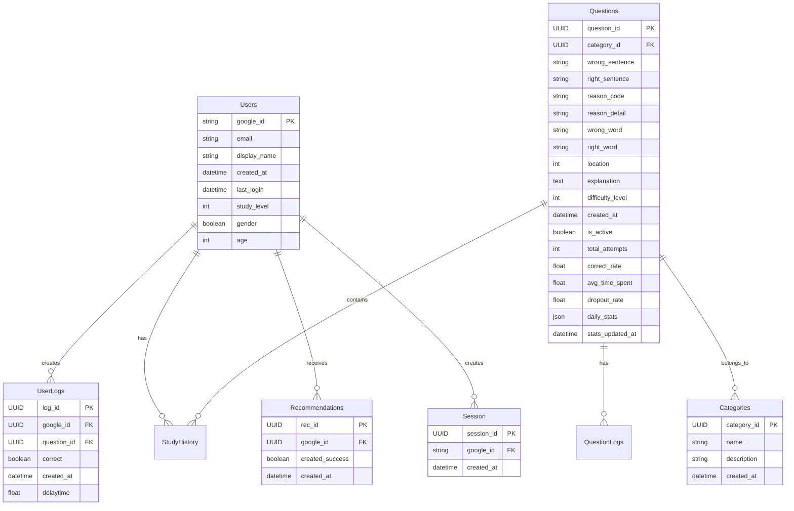

# 나랏말싸미 Project Documentation 01

## 1. ERD 구조




## 2. API Specification

### 2.1 Authentication APIs 인증 API
| Endpoint | Method | Description | Request | Response |
|----------|---------|-------------|----------|------------|
| `/api/auth/google` | POST | Google 로그인 | `{ access_token }` | `{ session_token, display_name, study_level }` |
| `/api/auth/verify` | POST | 세션 검증 | `{ session_token }` | `{ is_valid, display_name, study_level }` |
| `/api/auth/detail` | POST | 추가 회원 정보 설정 | `{ session_token, display_name, gender, age }` | `{ success }` |

### 2.2 Study APIs 학습 API
| Endpoint | Method | Description | Request | Response |
|----------|---------|-------------|----------|------------|
| `/api/questions` | GET | 문제 목록 조회 | `{ page, limit }` | `{ questions[], total }` |
| `/api/questions/{id}` | GET | 개별 문제 조회 | - | `{ question_detail }` |
| `/api/study/submit` | POST | 답안 제출 | `{ session_token, question_id, answer }` | `{ is_correct, explanation }` |
| `/api/study/history` | POST | 학습 이력 조회 | `{ session_token, limit }` | `{ history[] }` |

### 2.3 Recommendation APIs 추천 API
| Endpoint | Method | Description | Request | Response |
|----------|---------|-------------|----------|------------|
| `/api/recommendations` | POST | 추천 문제 목록 | `{ session_token }` | `{ rec_id }` |
| `/api/recommendations/success` | GET | 문제 추천 완료 확인 | `{ rec_id }` | `{ success, question_id[]? }` |

### 2.4 Statistics APIs 통계 API
| Endpoint | Method | Description | Request | Response |
|----------|---------|-------------|----------|------------|
| `/api/stats/user` | POST | 사용자 통계 | `{ session_token }` | `{ study_stats }` |
| `/api/stats/questions/{id}` | GET | 문제별 통계 | - | `{ question_stats }` |

## 3. 프로젝트 구조
```
narat-frontend/
├── src/
│   ├── api/
│   │   ├── auth.ts
│   │   ├── questions.ts
│   │   ├── recommendations.ts
│   │   ├── statistics.ts
│   │   └── types.ts
│   ├── components/
│   │   ├── common/
│   │   ├── auth/
│   │   ├── study/
│   │   └── statistics/
│   ├── pages/
│   │   ├── auth/
│   │   ├── study/
│   │   ├── recommendations/
│   │   └── statistics/
│   ├── types/
│   └── utils/
```

## 4. 현재 진행 상황 (initial commit)

### 4.1 Completed
1. Project initialization with Vite + React + TypeScript
2. API Types definition
3. API client setup with Axios
4. Authentication utilities
5. Common helper functions

### 4.2 File Status
- ✅ `src/api/types.ts`: All API interface definitions
- ✅ `src/api/auth.ts`: Authentication API implementations
- ✅ `src/api/questions.ts`: Question related API implementations
- ✅ `src/api/recommendations.ts`: Recommendation API implementations
- ✅ `src/api/statistics.ts`: Statistics API implementations
- ✅ `src/utils/api.ts`: Axios instance and interceptors setup
- ✅ `src/utils/auth.ts`: Authentication utilities
- ✅ `src/utils/helpers.ts`: Common helper functions

### 4.3 Dependencies Installed
```json
{
  "dependencies": {
    "axios": "^latest",
    "react": "^latest",
    "react-dom": "^latest",
    "react-router-dom": "^latest",
    "styled-components": "^latest"
  },
  "devDependencies": {
    "@types/node": "^latest",
    "@types/react": "^latest",
    "@types/react-dom": "^latest",
    "@types/styled-components": "^latest",
    "typescript": "^latest"
  }
}
```

## 5. Next Steps
1. React 컴포넌트 구현
2. 라우팅 설정
3. 인증 흐름 구현
4. 학습 인터페이스 제작
5. 추천 시스템 구현
6. 통계 시각화 추가


## 데이터 수집 및 레벨 구분 방안  

#### 1. 데이터 컬럼 설명  
수집된 데이터는 문장 및 단어 수준에서 문법 오류를 분석하고, 이를 분류하여 학습 추천 시스템에 활용할 수 있도록 구성됩니다.  

| 컬럼명 | 설명 | 예시 |
|--------|------|------|
| **Wrong_S** | 틀린 문장 | 뛰면 안되요 |
| **Right_S** | 옳은 문장 | 뛰면 안돼요 |
| **Category** | 문장 주제 또는 카테고리 | 스포츠 |
| **Reason_0_3** | 단어가 틀린 이유 (0~3) | 1 (헷갈리는 경우) |
| **Reason_K** | 오류 유형 분류 | 4 (어미 혼동) |
| **Wrong_W** | 틀린 단어 | 안되 |
| **Right_W** | 옳은 단어 | 안돼 |
| **loc** | 틀린 단어 위치 정보 | 뛰면 "안되"요 |
| **Clova 응답** | AI 기반 해설 | 안되다는 어쩌구 저쩌구 때문에 틀린 표현입니다. |

---

#### 2. `Reason_0_3` 값 정의  
- `0`: 없는 단어 → 착각 (예: 베개 ❌ 베게 ⭕)  
- `1`: 있는 단어 → 헷갈려하는 경우 (예: 금세 ❌ 금새 ⭕)  
- `2`: 띄어쓰기 오류 (예: 예쁘다 고 생각한다 ❌ → 예쁘다고 생각한다 ⭕)  
- `3`: 표준어 여부가 불분명한 단어 (예: 설레임 ❌ → 설렘 ⭕)  
- `4`: 최근 표준어로 인정된 표현  

---

#### 3. `Reason_K` 값 정의 (추천 제공을 위한 문제 유형)  
1. **한자어 혼동** → 감안하다 vs. 고려하다  
2. **피동/사동 오류** → 감기다 vs. 감다  
3. **구어체/문어체 혼동** → 했는데요 vs. 하였는데요  
4. **어미 혼동** → -데 vs. -대, -든지 vs. -던지  
5. **존댓말/반말 혼동** → 가세요 vs. 가요  
6. **방언/비표준어** → 거시기 vs. 그것  
7. **두 단어 혼합** → 간지럽다 vs. 간질하다 → 간지하다 ❌  
8. **외래어 표기 오류** → 콘센트 vs. 컨센트  
9. **중복 표현** → 미리 예약하다  
10. **의미 혼동** → 일절 vs. 일체  
11. **음운 변화 오류** → 눈꼽 ❌ → 눈곱 ⭕  
12. **축약/생략 오류** → 생각 해볼게요 ❌ → 생각해 볼게요 ⭕  

---

#### 4. 학습 레벨 (수우미양가 5단계)  
**사용자의 학습 수준을 `수(秀)`, 우(優), 미(美), 양(良), 가(可)` 5단계로 나누는 기준을 정의**  

| 학습 레벨 | 기준 (정답률 기반) | 설명 |
|-----------|----------------|------|
| **수 (秀)** | 정답률 90% 이상 | 거의 모든 문제를 맞춤 |
| **우 (優)** | 정답률 75~89% | 대부분 맞추지만 일부 실수 존재 |
| **미 (美)** | 정답률 50~74% | 중간 수준, 특정 유형에서 오류 발생 |
| **양 (良)** | 정답률 30~49% | 기초적인 문법 오류가 자주 발생 |
| **가 (可)** | 정답률 30% 미만 | 기본적인 맞춤법 지식이 부족 |

**레벨 조정 방식**  
- `UserLogs.correct` 비율을 기반으로 정기적으로 업데이트  
- 특정 유형(`Reason_K`)에서 반복적으로 틀릴 경우 해당 유형의 학습 문제 추천 강화  