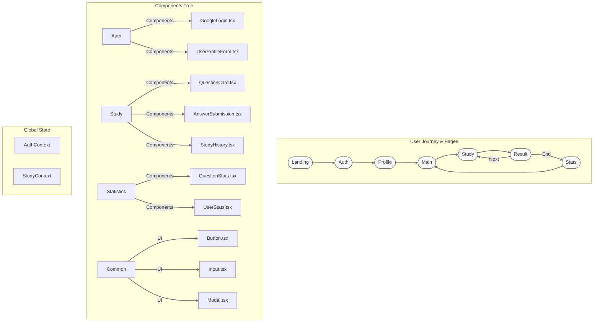

# 나랏말싸미 프로젝트 분석 문서

## 1. 기획 대비 변경사항

### 1.1 구조적 변경사항
1. **프레임워크 변경**
   - 기존: Vite + React + TypeScript
   - 변경: Next.js + TypeScript
   - 사유: 서버 사이드 렌더링 지원 및 라우팅 시스템 활용

2. **스타일링 방식**
   - 기존: styled-components만 사용
   - 변경: styled-components + 글로벌 스타일 시스템 추가
   - 사유: 일관된 디자인 시스템 구축 필요

### 1.2 미구현 기능
1. **추천 시스템**
   - 기획: 상세한 추천 알고리즘 및 API 명세
   - 현재: 기본 컴포넌트만 구현
   - TODO: 추천 로직 구현 필요

2. **상세 통계**
   - 기획: 다양한 통계 지표 제공
   - 현재: 기본적인 통계 표시만 구현
   - TODO: 상세 통계 기능 추가 필요

### 1.3 개선된 부분
1. **사용자 경험**
   - 토스 스타일의 모던한 UI/UX 적용
   - 부드러운 애니메이션 효과 추가
   - 직관적인 피드백 시스템 구현

2. **접근성**
   - ARIA 레이블 추가
   - 키보드 네비게이션 지원
   - 색상 대비 개선

## 2. 구현된 페이지별 특징

### 2.1 컴포넌트 분석표

| 컴포넌트 | 주요 특징 | 사용된 디자인 패턴 | 인터랙션 |
|---------|----------|-----------------|----------|
| QuestionCard | - 난이도 시각화<br>- 카테고리 태그<br>- 답안 공개 애니메이션 | - 카드 패턴<br>- 레이어드 디자인 | - 호버 효과<br>- 슬라이드 전환 |
| AnswerSubmission | - 실시간 유효성 검사<br>- 피드백 시스템<br>- 상태 전환 | - 폼 패턴<br>- 상태 기반 UI | - 입력 애니메이션<br>- 전환 효과 |
| UserProfileForm | - 단계별 입력<br>- 시각적 피드백<br>- 반응형 레이아웃 | - 스텝 패턴<br>- 그리드 시스템 | - 라디오 선택 효과<br>- 입력 검증 |
| GoogleLogin | - 소셜 로그인 통합<br>- 로딩 상태 표시<br>- 약관 링크 | - OAuth 패턴<br>- 모달 시스템 | - 버튼 애니메이션<br>- 로딩 스피너 |
| StudyHistory | - 타임라인 표시<br>- 성취도 시각화<br>- 필터링 기능 | - 리스트 패턴<br>- 필터 시스템 | - 스크롤 애니메이션<br>- 정렬 기능 |

### 2.2 디자인 시스템 특징

| 요소 | 설명 | 적용 사례 |
|-----|------|----------|
| 색상 | - Primary: 먹물 색상 계열(#1E3A8A)<br>- Secondary: 한지 색상 계열(#78350F)<br>- Status: 직관적 상태 색상 | - 버튼<br>- 알림<br>- 상태 표시 |
| 타이포그래피 | - 본문: Pretendard<br>- 제목: Noto Serif KR<br>- 크기: 8단계 시스템 | - 헤더<br>- 본문<br>- 버튼 |
| 여백 | - 8px 기반 스케일<br>- 일관된 간격 시스템<br>- 반응형 조정 | - 컴포넌트 간격<br>- 내부 여백<br>- 레이아웃 |
| 애니메이션 | - 3단계 속도 체계<br>- 부드러운 전환<br>- 상태 기반 변화 | - 버튼 호버<br>- 모달<br>- 폼 전환 |

## 3. 향후 개선사항

### 3.1 기능적 개선
1. **추천 시스템 구현**
   - 사용자 학습 패턴 분석
   - 개인화된 문제 추천
   - 난이도 자동 조정

2. **통계 기능 강화**
   - 상세 학습 분석 제공
   - 진도율 시각화
   - 취약점 분석 리포트

3. **학습 경험 개선**
   - 오답 노트 기능
   - 복습 알림 시스템
   - 학습 목표 설정

### 3.2 기술적 개선
1. **성능 최적화**
   - 코드 스플리팅
   - 이미지 최적화
   - API 응답 캐싱

2. **테스트 coverage 확대**
   - 단위 테스트 추가
   - 통합 테스트 구현
   - E2E 테스트 도입

3. **모니터링 강화**
   - 에러 트래킹 시스템
   - 사용자 행동 분석
   - 성능 모니터링

## 4. 미구현 API 목록

1. **추천 API**
   ```typescript
   // 미구현
   GET /api/recommendations/success
   POST /api/recommendations
   ```

2. **통계 API**
   ```typescript
   // 부분 구현
   GET /api/stats/questions/{id}
   POST /api/stats/user
   ```

## 5. 레벨 시스템 구현 현황

현재 구현된 레벨 시스템은 기획안의 5단계(수우미양가)를 반영하고 있으나, 다음 기능들이 추가로 필요합니다:

1. **레벨 산정 로직**
   - 정답률 기반 자동 조정
   - 연속 정답/오답 반영
   - 난이도별 가중치 적용

2. **레벨업 시스템**
   - 레벨업 축하 메시지
   - 성취 뱃지 시스템
   - 학습 이력 리포트


### 유저저니

   narat-frontend/
├── src/
│   ├── app/
│   │   ├── layout.tsx        # 앱 레이아웃
│   │   └── page.tsx          # 메인 페이지
│   │
│   ├── components/
│   │   ├── auth/
│   │   │   ├── GoogleLogin.tsx
│   │   │   └── UserProfileForm.tsx
│   │   ├── common/
│   │   │   ├── Button.tsx
│   │   │   ├── Input.tsx
│   │   │   └── Modal.tsx
│   │   ├── study/
│   │   │   ├── QuestionCard.tsx
│   │   │   ├── AnswerSubmission.tsx
│   │   │   └── StudyHistory.tsx
│   │   └── statistics/
│   │       ├── QuestionStats.tsx
│   │       └── UserStats.tsx
│   │
│   ├── context/
│   │   ├── AuthContext.tsx   # 인증 상태 관리
│   │   └── StudyContext.tsx  # 학습 상태 관리
│   │
│   ├── styles/
│   │   ├── theme.ts          # 디자인 시스템
│   │   └── global.ts         # 전역 스타일
│   │
│   └── utils/
│       ├── api.ts            # API 클라이언트
│       └── auth.ts           # 인증 유틸리티
```